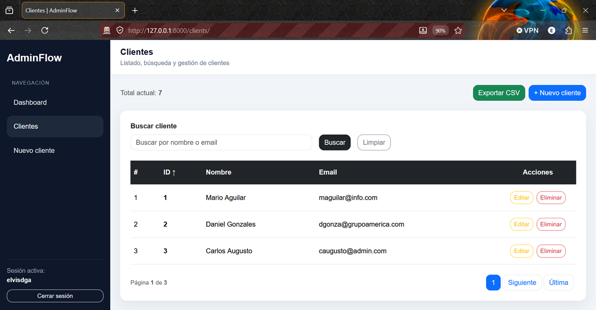
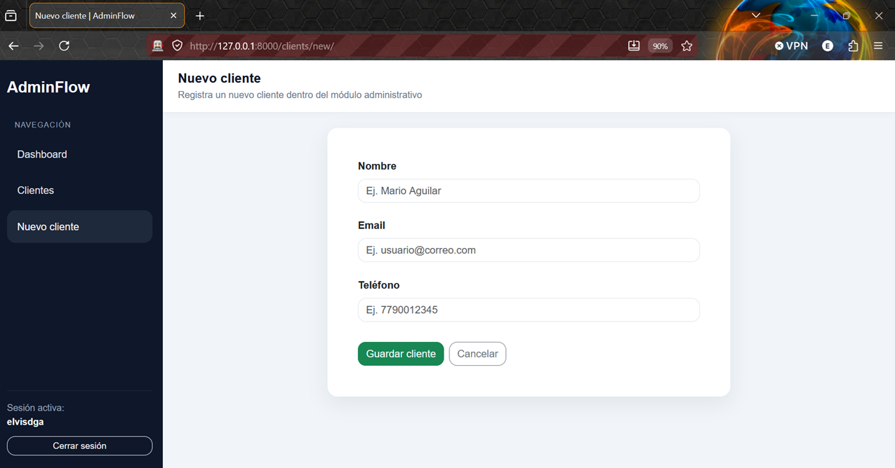
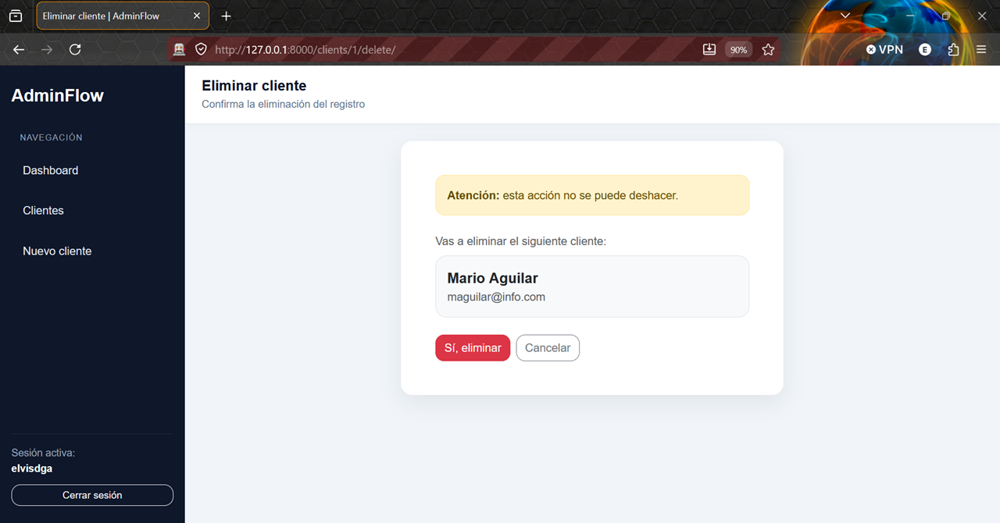

# AdminFlow

AdminFlow es un sistema web administrativo desarrollado con Django, orientado a la gestión interna de registros y operaciones básicas de negocio. Actualmente incluye un módulo funcional de gestión de clientes con interfaz administrativa refinada y validada en entorno local.

## Objetivo del proyecto

Este proyecto nace como base para un panel administrativo interno, con enfoque en orden, escalabilidad y experiencia de usuario. La idea es construir módulos reutilizables que permitan administrar información de forma clara, rápida y profesional.

## Estado actual

El proyecto ya cuenta con un módulo CRUD de clientes completamente funcional y visualmente refinado.

### Funcionalidades validadas
- Listado de clientes
- Creación de clientes
- Edición de clientes
- Eliminación con confirmación previa
- Búsqueda por nombre o email
- Ordenamiento por ID, nombre y email
- Paginación
- Mensajes flash de éxito
- Interfaz administrativa consistente


## Screenshots

### Listado de clientes


### Formulario de cliente


### Confirmación de eliminación



## Stack tecnológico

- Python 3.12
- Django
- Bootstrap 5
- SQLite (entorno actual)
- Git y GitHub

## Estructura base del módulo de clientes

```text
core/
├── forms.py
├── models.py
├── urls.py
├── views.py
└── templates/
    └── core/
        ├── client_list.html
        ├── client_form.html
        └── client_confirm_delete.html
Captura funcional del módulo

El sistema incluye una interfaz administrativa con:

listado de clientes
formulario de creación y edición
confirmación visual de eliminación
mensajes de feedback
ordenamiento y paginación

Recomendación: agregar screenshots del módulo en una carpeta docs/ o screenshots/ para mejorar la presentación del repositorio.

Cómo ejecutar el proyecto en local
1. Clonar el repositorio
git clone https://github.com/elvisdga/adminflow.git
cd adminflow
2. Activar entorno virtual

Si ya existe .venv:

source .venv/bin/activate
3. Instalar dependencias
pip install -r requirements.txt
4. Aplicar migraciones
python manage.py migrate
5. Levantar servidor de desarrollo
python manage.py runserver 0.0.0.0:8000
6. Abrir en navegador
http://127.0.0.1:8000/clients/
Comandos útiles de desarrollo
Verificar entorno Python activo
which python
Comprobar configuración Django
python manage.py check
Revisar estado del repositorio
git status
Flujo de trabajo recomendado

Para este proyecto se recomienda:

Activar siempre el entorno virtual antes de ejecutar comandos Django
Validar con python manage.py check después de cambios importantes
Probar en navegador antes de hacer commit
Guardar cambios con commits claros y trazables
Próximas mejoras sugeridas
Vista de detalle de cliente
Exportación de clientes a CSV
Mejoras de validación visual
Dashboard con métricas
Autenticación de usuarios
Módulos adicionales (proveedores, facturas, tareas, etc.)
Propósito de portafolio

AdminFlow también funciona como proyecto demostrativo para mostrar:

estructura real con Django
organización modular
CRUD completo
uso de CBV
trabajo con templates
refinamiento UI orientado a entorno administrativo
Autor

Desarrollado por Elvis Gaitán.
